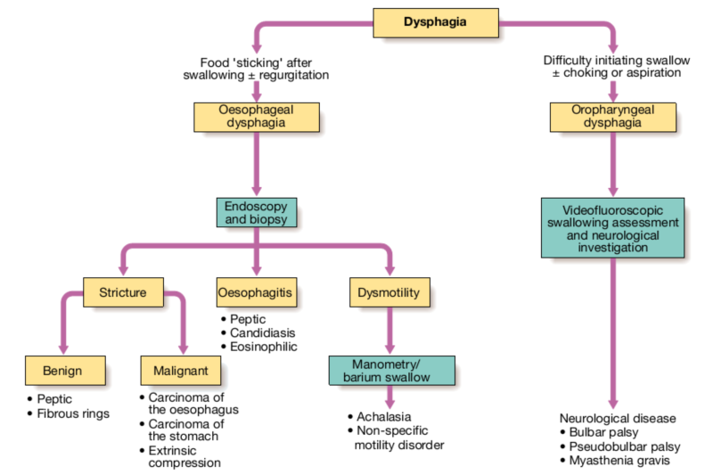

Dysphagia
===========

Causes
--------
>**List the common causes of dysphagia**

####**Dysphagia** = Difficuly in swallowing
####**Odynophagia** = Pain on swallowing

**Pharyngeal/Oesophageal**

  * [Tonsilitis](tonsilitis.jpg)
  * Mysathenia Gravis 
	* Autoimmune neuromuscular disease
	* Circulating antibodies block the ACh receptors at the post-synaptic neuromuscular junction
  * Upper Oesophageal Achalasia 
	* Failure of smooth muscle fibres to relax
  * Cerebrovascular Accident

Note: Most common cause is a CVA (Cerebrovascular Accident) causing damage to the 9th, 10th and 12th cranial nerves

**Oesophageal**

  * Achalasia
	* Destruction of ganglion cells in [myenteric plexus](myenteric.png)
		* Lose ability to relax lower oesophageal sphincter
		* Disordered oesophageal motility
	* Massive dilation of lower oesphagus
		* Due to food piling above tightened sphincter
	* [Bird-beak sign](birdbeak.jpg)
		* Combination of massive dilation and tightened sphincter
	* Increased risk of oesophageal SCC (Squamous Cell Carcinoma)
  * Oesophageal Web
	* Mucosal layer protrudes causing partial/total obstruction
	* Occurs in upper oesophagus
	* Increased risk for oesophageal SCC (Squamous Cell Carcinoma)
  * [Plummer-Vinson Syndrome](plummer-vinson.png)
	* Oesophageal Web
	* Severe iron-deficiency anaemia
		* Presents with angular chelitis
	* Beefy red tounge
		* Atrophic Glossitis due to atrophy of mucosa
		* Red colour due to exposed blood vessels
  * Luminal Obstruction
	* Carcinoma
  * Scleroderma
	* Thickening of oesophageal wall

**External**

  * Diabetes
	* Motility disorders in upper GI tract -> Delayed Gastric emptying
  * Chagas' Disease 
	* American trypanosomiasis -> Tropical parasite disease
	* Cell death causes inflammatory response and fibrosis
	* Secondary Achalasia
  * Goitre
	* Particularly retrosternal

Investigations
--------
>**Discuss investigations of dysphagia** 

Symptoms of Malignancy
--------
>**List the symptoms suggestive of an oesophageal malignancy**

####Clinical Features

  * Age group is **60-70 years**
  * **Dysaphagia** is the most common symptom
  * **Retrosternal** chest pain
  * Coughing
  * Aspiration into lungs

Pathology of Malignancy
--------
>**Describe the pathology and natural history of oesophageal malignancy**

####Squamous Cell Carcinoma (SCC)

  * Male
  * Heavy Drinkers
  * Heavy smokers
  * Regional lymph node spread - early and common

####Adenocarcinomas

  * Arise from columnar-lined epithelium
  * Heavy Drinkers
  * Heavy smokers
  * Regional lymph node spread - early and common

Gimmicks
--------

Through the usage of [Gimmicks][gimmicks], which are like plugins, you can add much more dynamic elements into your wiki and use it in a very advanced way. See the [Gimmicks][gimmicks] page for a full reference.

  [gfmsheet]: https://github.com/adam-p/markdown-here/wiki/Markdown-Cheatsheet
  [gfm]: http://github.github.com/github-flavored-markdown/
  [markdown]: http://daringfireball.net/projects/markdown/

